Product Engineer @ <a href="https://github.com/UtahAILab">Utah AI Lab</a> · B.S. Electrical Engineering, University of Utah

<strong><a href="https://holdenjdao.github.io">holdenjdao.github.io</a></strong>

## ⚡ Toolchain

|  |  |
|---|---|
| `languages` |        |
| `hardware / rf` |       |
| `ai / infra` |         |

## 📡 Selected Work

| project | signal path | stack |
|---|---|---|
| **[Dori](https://github.com/Xanderman27/Dori)** | `check-in ─▶ Bayesian knowledge tracing ─▶ next item` — accessible K-12 practice platform for students with IEPs and 504 plans; **🥉 3rd place**, Minds and Machines AWS Hackathon | `Python` `FastAPI` `React` `AWS Bedrock` |
| **[CareCart](https://github.com/Xanderman27/CareCart)** | `bilingual form ─▶ triage ─▶ staff queue` — intake and fulfillment for a children's community health team, every request prioritized and routed on arrival; **🥈 2nd place**, Intermountain Health Generative AI Hackathon | `Next.js` `TypeScript` `Claude API` |
| **Weather Satellite Imaging Receiver** | `antenna ─▶ RTL-SDR ─▶ GNU Radio ─▶ demod ─▶ earth imagery` — decodes METEOR M2-4 transmissions with a hand-built antenna, >90% image reconstruction | `GNU Radio` `CST Studio` `DSP` |
| **GPS Tracking Device** | `NEO-6M ─▶ ESP32 ─▶ telemetry` — real-time coordinates, speed, and altitude at 99% accuracy | `C` `Rust` `ESP32` |
| **[Prompt Intent Taxonomy](https://github.com/holdenjdao/tokenomics)** | `prompt ─▶ intent IR ─▶ router` — provider-neutral schema for what a user wants from an AI system, so routers can pick cheaper execution paths | `YAML` `JSON Schema` |
| **[Portfolio](https://github.com/holdenjdao/holdenjdao.github.io)** | live at [holdenjdao.github.io](https://holdenjdao.github.io) | `HTML` `CSS` `JS` |

## 📊 Telemetry

---

&nbsp;

&nbsp;

